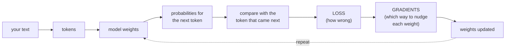
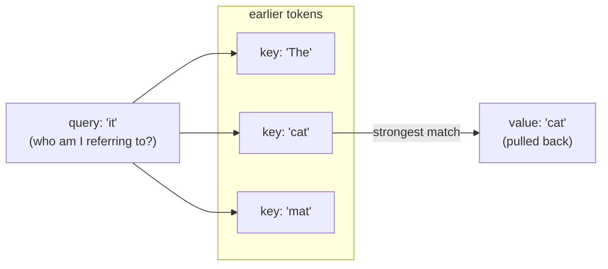
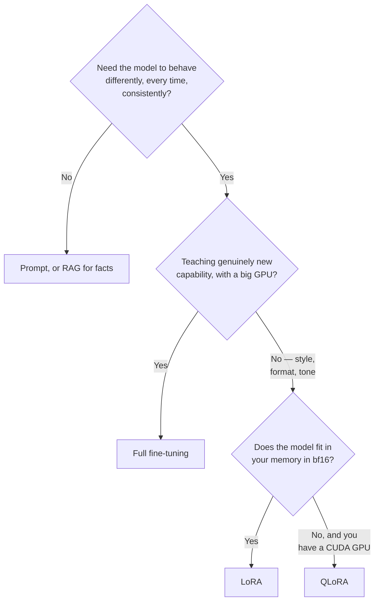

# Fine-Tuning from Zero — the concepts

This file explains the ideas. [TUTORIAL.md](TUTORIAL.md) is where you actually use them.

**You won't find a single command here.** Every section links to the lesson
where you go put the idea into practice. If you'd rather start by typing than
reading, jump to [Lesson 1](TUTORIAL.md#l-install) and follow the **Concept:**
links back here whenever a word trips you up.

<a id="f-audience"></a>
## Who this is for

Anyone who's used a chatbot and now wants to change how one behaves.

**Assumed knowledge:** none. No machine-learning background, no calculus, no
GPU required. Wherever maths shows up, it's tucked into a collapsible box you
can skip without losing the thread.

**Time:** about 45 minutes (go at your own pace), and a willingness to read
"a matrix is a grid of numbers" without flinching.

**What you'll get out of it:** enough grounding that the tutorial's commands
stop feeling like incantations. When it tells you to set `lora.r: 16`, you'll
actually know what rank means, why 16 was chosen, and what breaks if you push
it to 64.

<a id="f-how-to-read"></a>
## How to read this alongside the tutorial

| Route | Do this | Good if |
| --- | --- | --- |
| **Concepts first** | Read this file top to bottom, then start the tutorial | You like knowing "why" before "how" |
| **Hands first** | Start at [Lesson 1](TUTORIAL.md#l-install); follow each **Concept:** link back here when a term is unfamiliar | You learn by doing |
| **Reference** | Skip to the [glossary](#f-glossary) and search | You are already fluent and hit one unknown word |

All three routes work fine. Both files are written so you can read them in
either order.

<a id="f-one-page"></a>
## The whole thing on one page

Two diagrams. Everything else in this file is just an expansion of one box
from one of them.

**How a model learns.** This is the loop that runs a few hundred times during
training:



Each box has a section: [tokens](#f-tokens) · [model weights](#f-weights) ·
[loss](#f-loss) · [gradients](#f-gradient-descent) · [the loop itself](#f-training-loop).

**What LoRA changes.** This is why the whole thing fits on a laptop:

```text
   FULL FINE-TUNING                     LoRA
   ─────────────────                    ────
                                          W  ← frozen, untouched
    W  ← all 1.5B numbers               1,545,893,376 numbers
       updated                                  +
                                          B · A  ← trained
   needs ~24 GB                          2,179,072 numbers
                                         needs ~4.7 GB
```

Each box has a section: [why the update is low-rank](#f-rank) ·
[LoRA itself](#f-lora) · [what the trained file contains](#f-adapter-file) ·
[where the memory goes](#f-full-finetuning).

<a id="f-map"></a>
## Where to practise each concept

Every concept below is paired with the lesson where you actually go do it.

> Maintenance note: this table also lives at [TUTORIAL.md#t-map](TUTORIAL.md#t-map).
> When a row changes, change it in both. Here the Concept links are bare `#f-…`
> and the Practice links are `TUTORIAL.md#l-…`; there they are reversed.

| Concept | Practise it |
| --- | --- |
| **A — What a language model is** | |
| [A1 What an LLM actually does](#f-what-is-an-llm) | [L3 Meet the base model](TUTORIAL.md#l-meet-the-base-model) |
| [A2 Tokens and tokenizers](#f-tokens) | [L4 Tokens on your own text](TUTORIAL.md#l-tokens) |
| [A3 Weights and parameters](#f-weights) | [L13 Estimating cost](TUTORIAL.md#l-cost-estimate) |
| [A4 Inside a transformer block](#f-transformer) | [L12 Rank, alpha and target modules](TUTORIAL.md#l-rank-alpha-modules) |
| **B — How a model learns** | |
| [B1 The training loop](#f-training-loop) | [L14 Your first training run](TUTORIAL.md#l-first-run) |
| [B2 Loss](#f-loss) | [L15 Reading the loss curve](TUTORIAL.md#l-loss-curve) |
| [B3 Gradient descent](#f-gradient-descent) | [L15 Reading the loss curve](TUTORIAL.md#l-loss-curve) |
| [B4 Batch, step, epoch](#f-batch-step-epoch) | [L11 Reading the config](TUTORIAL.md#l-config) |
| [B5 Learning versus memorising](#f-overfitting) | [L20 Held-out and out-of-domain](TUTORIAL.md#l-heldout-vs-ood) |
| **C — Kinds of training** | |
| [C1 Pretraining, SFT, alignment](#f-pretraining-sft-alignment) | [L11 Reading the config](TUTORIAL.md#l-config) |
| [C2 Prompting, RAG, or fine-tuning](#f-prompt-rag-finetune) | [L3 Meet the base model](TUTORIAL.md#l-meet-the-base-model) |
| **D — Making fine-tuning fit** | |
| [D1 Full fine-tuning, and why it does not fit](#f-full-finetuning) | [L13 Estimating cost](TUTORIAL.md#l-cost-estimate) |
| [D2 Rank, in actual linear algebra](#f-rank) | [L12 Rank, alpha and target modules](TUTORIAL.md#l-rank-alpha-modules) |
| [D3 LoRA](#f-lora) | [L12 Rank, alpha and target modules](TUTORIAL.md#l-rank-alpha-modules) |
| [D4 What is in an adapter file](#f-adapter-file) | [L16 Inside the adapter file](TUTORIAL.md#l-adapter-file) |
| [D5 Precision and quantization](#f-quantization) | [L17 Quantization in practice](TUTORIAL.md#l-quantization) |
| [D6 QLoRA](#f-qlora) | [L18 QLoRA, Unsloth and MLX](TUTORIAL.md#l-qlora-backends) |
| [D7 Choosing between them](#f-choosing) | [L18 QLoRA, Unsloth and MLX](TUTORIAL.md#l-qlora-backends) |
| **E — Using and judging the result** | |
| [E1 Inference](#f-inference) | [L19 Inference and temperature](TUTORIAL.md#l-inference) |
| [E2 What "it works" means](#f-evaluation) | [L20](TUTORIAL.md#l-heldout-vs-ood) · [L21](TUTORIAL.md#l-case-study) |
| **F — Hardware and memory** | |
| [F1 Where the memory goes](#f-memory-hardware) | [L1 Install](TUTORIAL.md#l-install) · [L22 Diagnosing failures](TUTORIAL.md#l-diagnosing) |

Tutorial Part 3 (dataset design, Lessons 6–10) doesn't have a matching concept
section. That part of fine-tuning is craft, not theory, so the tutorial just
teaches it directly instead of routing you back here.

---

<a id="fa-what-a-model-is"></a>
## Part A — What a language model is

---

<a id="f-what-is-an-llm"></a>
### A1. What an LLM actually does

A large language model does one thing: it reads a sequence of text
and predicts which chunk is most likely to come
next. That's genuinely the whole trick.

Everything else you'll read about below is that single operation running in
a loop. To write a sentence, the model predicts one chunk, tacks it onto what
it already has, then predicts again from the now-longer text. This is called
being **autoregressive**: each output feeds straight back in as the next
input.

```text
   "The capital of France is"          ──▶  " Paris"   (most likely next)
   "The capital of France is Paris"    ──▶  "."
   "The capital of France is Paris."   ──▶  <end>
```

It's fair to find that unsatisfying. Answering questions, writing code,
refusing requests: none of that feels like next-chunk prediction. But once a
model has read enough text, "the most likely continuation of a question is
its answer" turns out to do an enormous amount of the work on its own. The
later training stages covered in [C1](#f-pretraining-sft-alignment) then
shape that raw tendency into something that behaves like an assistant.

Two things follow from this, worth keeping in mind:

- **It has no memory between conversations.** Everything it knows about the
  current exchange lives in the text sitting in front of it right now,
  called the **context window**. For Qwen2.5-1.5B, that window is 32,768
  tokens.
- **It has no concept of truth, only of likelihood.** A fluent wrong answer
  and a fluent right one look equally plausible from the inside, which is
  exactly why the tutorial keeps insisting that a persona fine-tune doesn't
  make a model more correct. Just more consistent.

> **→ Practise it:** [Lesson 3 — Meet the base model before you change it](TUTORIAL.md#l-meet-the-base-model)

---

<a id="f-tokens"></a>
### A2. Tokens and tokenizers

A token is a chunk of text, usually a word-piece of about four characters.
The tokenizer is the lookup table that turns your text into the integer
token ids a model actually works with.

Models never see letters or words directly. Before anything else happens,
your text gets split into tokens, and each token gets swapped for its id: a
number indexing a fixed **vocabulary**. Qwen2.5-1.5B's embedding table holds
151,936 rows. (A tokenizer will actually report a couple of slightly
different figures: `tok.vocab_size` comes back as 151,643, which excludes
tokens added after training, and `len(tok)` comes back as 151,665. The
embedding size is the one that actually costs you memory.)

The splitting itself is learned from data, not from spaces. Common words
come out as a single token; rarer ones get fractured into pieces. You can
watch this happen yourself in [Lesson 4](TUTORIAL.md#l-tokens):

```text
   "What is photosynthesis?"

   "What"  " is"  " photos"  "ynthesis"  "?"
    3838    374      7249      73667      30
```

Notice that `" is"` carries its leading space; spaces belong to tokens, not
the words next to them. And notice that `photosynthesis`, a perfectly
ordinary word, still comes out as two pieces. Names fracture especially
often, which matters for a project built around repeating one person's name
several hundred times.

**Special tokens** are vocabulary entries that mark structure instead of
actual text. Here are the ones that matter for this project:

| Token | Purpose |
| --- | --- |
| **EOS** (end of sequence) | Marks where a reply stops. Qwen's id is 151645 |
| **BOS** (beginning of sequence) | Marks where text starts. Qwen does not use one |
| `<\|im_start\|>` / `<\|im_end\|>` | Qwen's chat markers, wrapping each conversation turn |

EOS deserves its own warning. If the end-of-sequence token never shows up in
what the model is trained to produce, the model never learns that replies
are supposed to end, and at inference time it just keeps generating until it
hits a hard limit. This is probably the single most common way a fine-tune
breaks, so the tutorial checks for it explicitly.

**Everything gets measured in tokens, not words.** Sequence limits, memory,
cost, speed: they all count tokens. A rough rule of thumb for English is
about 4 characters or 0.75 words per token, but the only way to actually
know is to run the tokenizer yourself.

> **→ Practise it:** [Lesson 4 — Tokens on your own text](TUTORIAL.md#l-tokens)

---

<a id="f-weights"></a>
### A3. Weights, parameters, and what "1.5B" means

A parameter is a single number living inside the model. Training is simply
the act of changing those numbers.

Those numbers are organised into **matrices**, which are just grids of
numbers. A matrix's job is to transform one list of numbers into another
list. Feed in 1536 numbers describing a token, multiply by a 1536×1536
matrix, and 1536 different numbers come out the other side. Stack enough of
these transformations together and you end up with something that can
continue text.

A **weight** is a single entry in one of those grids, and "1.5 billion
parameters" just means counting every entry in every matrix in the model.
Here are the real shapes for Qwen2.5-1.5B:

| Component | Shape | Parameters |
| --- | --- | --- |
| Hidden size | 1536 | the width of the model |
| Layers | 28 | identical blocks, stacked |
| `q_proj` (per layer) | 1536 → 1536 | 2,359,296 |
| `k_proj`, `v_proj` (per layer) | 1536 → 256 | 393,216 each |
| `o_proj` (per layer) | 1536 → 1536 | 2,359,296 |
| MLP `gate`/`up` (per layer) | 1536 → 8960 | 13,762,560 each |
| MLP `down` (per layer) | 8960 → 1536 | 13,762,560 |
| Vocabulary embedding | 151,936 × 1536 | 233,373,696 |
| Attention heads / KV heads | 12 / 2 | grouped-query attention, head dim 128 |

Add it all up and you land near 1.5 billion, which is where the model's name
comes from.

Two things follow from this. First, **model size on disk is just parameters
times bytes-per-parameter**, so the exact same model can be 6.2 GB, 3.1 GB,
or 0.8 GB depending only on the number format you store it in
([D5](#f-quantization)). Second, **training means changing these numbers**,
which is the entire difference between fine-tuning and prompting: prompting
changes what you feed into the matrices, fine-tuning changes the matrices
themselves.

> **→ Practise it:** [Lesson 13 — Estimating cost before you pay it](TUTORIAL.md#l-cost-estimate)

---

<a id="f-transformer"></a>
### A4. Inside a transformer block

A transformer block lets every token look back at every earlier token and
pull in whatever's relevant, then runs the result through a small
feed-forward network. The names of the matrices doing that looking are
exactly what you'll later have to choose between.

This section is deliberately narrow: enough for you to know what you're
adapting, not enough to actually build one from scratch.

**Attention** is the part where tokens look at other tokens. For each token,
the model builds three vectors, one from each of three different matrices:

| Vector | Matrix | Role |
| --- | --- | --- |
| **Query** | `q_proj` | what this token is looking for |
| **Key** | `k_proj` | what each token offers as a match |
| **Value** | `v_proj` | what each token actually contributes |

Every token's query gets compared against every earlier token's key. Strong
matches get a high weight, and the token pulls back a blend of those tokens'
values. A fourth matrix, `o_proj`, then mixes the result back into the main
stream.

```text
   "The cat sat on the mat because it was tired"
                                       │
                        "it" forms a query: who am I referring to?
                        compares against every earlier key
                        strongest match: "cat"
                        pulls back "cat"'s value
```



That's why the names `q_proj` and `v_proj` matter to you specifically. When
[LoRA](#f-lora) asks which matrices to adapt, `target_modules` is naming
exactly these two. Adapting the query and value projections is the classic
minimal choice, since it changes what the model looks for and what it
retrieves, and that's where behavioural change tends to live.

After attention comes an **MLP** (`gate_proj`, `up_proj`, `down_proj`),
which expands each token's 1536 numbers out to 8960, applies a
non-linearity, then squeezes it back down to 1536. **Residual connections**
add each sub-layer's output back onto its input so information can skip past
unchanged, and **layer normalisation** keeps the numbers within a sane
range.

Then the whole thing repeats: 28 identical blocks, stacked one after
another.

> **→ Practise it:** [Lesson 12 — Rank, alpha and target modules in practice](TUTORIAL.md#l-rank-alpha-modules)

> **Big picture:** every idea in this Part collapses into one fact worth
> holding onto: there is no separate "knowledge module" and no separate
> "style module" inside a language model. Tokens, weights and attention are
> the entire machine, and whatever changes them (pretraining, fine-tuning,
> even a single training example) touches the same substrate that produces
> both the facts a model knows and the shape of how it says them. That's why
> a persona fine-tune can silently damage a model's coding ability
> ([Lesson 6](TUTORIAL.md#l-response-shape)) even though nobody trained on
> code at all.

---
<a id="fb-how-learning-works"></a>
## Part B — How a model learns

---

<a id="f-training-loop"></a>
### B1. The training loop

Training is really just six steps on repeat: take a batch of examples, run
them through the model, measure how wrong the output was, figure out which
direction each weight should move, nudge them a little, and go again.

Every term in this part has a home in that loop:

```text
   1. BATCH        take a handful of training examples
   2. FORWARD      run them through the model, get predictions
   3. LOSS         measure how wrong the predictions were
   4. BACKWARD     work out which way to nudge each weight
   5. STEP         apply the nudges
   6. repeat
```

| Step | Explained in |
| --- | --- |
| 1. Batch | [B4 Batch, step, epoch](#f-batch-step-epoch) |
| 2. Forward | [A1 What an LLM actually does](#f-what-is-an-llm) |
| 3. Loss | [B2 Loss](#f-loss) |
| 4. Backward · 5. Step | [B3 Gradient descent](#f-gradient-descent) |

Step 4 is **backpropagation**, the chain rule from calculus applied
backwards through the network. It produces, for every single weight, a
number that says roughly "if you nudge this up, the loss goes up by about
this much." You don't need to derive it yourself. You just need to know it
exists, that it's what the **backward pass** actually does, and that it's
the reason training needs so much more memory than simply running a model:
every intermediate value from the forward pass has to stick around so the
backward pass can use it.

One pass over all your training data is an **epoch**. This project does
three.

> **→ Practise it:** [Lesson 14 — Your first training run](TUTORIAL.md#l-first-run)

---

<a id="f-loss"></a>
### B2. Loss: what the number means

Loss measures how surprised the model was by the token that actually came
next. Lower means less surprised.

At every position, the model outputs a probability for every single token in
its vocabulary. Cross-entropy loss then looks at whichever token actually
came next and takes the negative logarithm of the probability the model
assigned to it. Confident and correct scores close to zero. Confident and
wrong scores enormous.

**This table is probably the most useful thing in this whole section**,
because it turns loss into something you can actually picture:

| Loss | Probability on the correct token | Reading |
| --- | --- | --- |
| 4.61 | 1% | badly lost |
| 2.30 | 10% | weak |
| **2.20** | **11%** | where this project's training starts |
| 1.61 | 20% | learning |
| **1.03** | **36%** | where this project's training ends |
| 0.69 | 50% | strong |
| 0.10 | 90% | suspiciously strong on a small dataset |
| 0.01 | 99% | memorised |

So "loss fell from 2.20 to 1.03" now means something concrete: the model
went from putting roughly 11% of its confidence on the correct next token to
roughly 36%. It also makes the tutorial's warning obvious: loss creeping
toward zero on a few hundred examples is a **red flag, not a triumph**.
Ninety-nine percent confidence on every token of your training set just
means the model memorised the set instead of learning the pattern behind
it.

**Perplexity** is just `e` raised to the loss. A loss of 1.03 works out to a
perplexity of about 2.8, meaning the model is roughly as uncertain as if it
were picking between 2.8 equally likely tokens.

<details><summary>The maths, if you want it</summary>

For one position with correct token *t* and predicted probability *p(t)*:

```text
   loss = −log p(t)
```

Over a whole sequence, the reported loss is just the mean of that across
every position where a loss actually gets computed. That caveat matters: in
chat fine-tuning the user's tokens are usually excluded, so the number only
describes how well the model produces the *assistant* side of the
conversation.

</details>

> **→ Practise it:** [Lesson 15 — Reading the loss curve](TUTORIAL.md#l-loss-curve)

---

<a id="f-gradient-descent"></a>
### B3. Gradient descent

A gradient tells you which direction to nudge a weight to make the loss
smaller. Gradient descent is just nudging every weight that way, over and
over.

Picture the loss as a landscape. Every weight is its own axis, so
technically this landscape has 1.5 billion dimensions, but the intuition
still holds up in a picture we actually can draw: you're standing somewhere
on a hilly surface, trying to reach the bottom. The **gradient** is the
slope under your feet, and descent just means stepping downhill.

The **learning rate** decides how big a step you take. It's arguably the
single most consequential number in a fine-tuning config, and it can fail in
two opposite directions:

```text
   TOO SMALL (lr = 2e-5 on a LoRA)      TOO BIG                    ABOUT RIGHT
   ────────────────────────────────     ───────                    ───────────
   ╲                                    ╲    ╱╲    ╱╲              ╲
    ╲___________                         ╲  ╱  ╲  ╱  ╲              ╲___
                                          ╲╱    ╲╱    → NaN             ╲______

   barely moves; your                   overshoots the valley       falls, then flattens
   fine-tune does nothing               and diverges
```

That left-hand picture isn't hypothetical, by the way. `2e-5` is a perfectly
sensible learning rate for full fine-tuning, but it's roughly ten times too
small for LoRA. The symptom looks like a model that answers correctly with
zero trace of the behaviour you actually trained. The tutorial has you
reproduce this on purpose so you recognise it later.

Two refinements you'll see in the config:

- **Warmup** ramps the learning rate up gradually over the first few percent
  of steps, because early gradients tend to be large and erratic. Stepping
  fully into them right away can wreck the adapter before training even
  gets going.
- A **scheduler** changes the learning rate as training goes on. `cosine`
  decays it smoothly toward zero, so you get big strides early and
  fine-tuned ones later.

The **optimizer** is what actually applies the update. Plain gradient
descent just uses the raw gradient. **Adam**, which almost everything uses
these days, keeps two running averages per weight instead (roughly speaking,
recent direction and recent volatility) and uses them to scale each weight's
step individually. That's why it tends to work so well, and also why it
costs memory: two extra numbers for every trainable parameter, which is
exactly where the 16-bytes-per-parameter figure in [D1](#f-full-finetuning)
comes from.

<details><summary>The maths, if you want it</summary>

```text
   w  ←  w  −  lr × ∂L/∂w
```

Each weight *w* moves opposite its gradient, scaled by the learning rate.
Adam swaps in a normalised version of the gradient built from its two
running averages, but the basic shape of the update stays the same.

</details>

> **→ Practise it:** [Lesson 15 — Reading the loss curve](TUTORIAL.md#l-loss-curve)

---

<a id="f-batch-step-epoch"></a>
### B4. Batch, step, epoch, and the memory they cost

A batch is a handful of examples processed together. A step is one update to
the weights. An epoch is one full pass over your data.

| Term | Meaning |
| --- | --- |
| **Batch** | Examples processed together in one forward pass |
| **Batch size** | How many. Bigger uses more memory and gives smoother gradients |
| **Step** | One weight update |
| **Epoch** | One full pass over the training set |

Here's the complication: big batches are good for stability but bad for
memory. **Gradient accumulation** solves it by running several small
batches, adding up their gradients, and only then taking one step. You get
the smoothness of a large batch at the memory cost of a small one.

So the number that actually matters isn't `batch_size` on its own, it's the
product:

```text
   effective batch = batch_size × grad_accum
```

With `batch_size: 1` and `grad_accum: 4`, the optimizer sees 4 examples per
step. From there the step count is arithmetic:

```text
   steps per epoch = training rows ÷ effective batch
   total steps     = steps per epoch × epochs
```

Two more terms belong here too, since they're about memory rather than
maths:

- **Activations** are the intermediate values from the forward pass, kept
  around so the backward pass can use them. They scale with `batch_size ×
  sequence length`, which is why sequence length works as a memory knob and
  not just a truncation setting.
- **Gradient checkpointing** throws most activations away and recomputes
  them during the backward pass instead. It costs roughly 20% more time but
  saves a dramatic amount of memory.

> **→ Practise it:** [Lesson 11 — Reading the config, knob by knob](TUTORIAL.md#l-config)

---

<a id="f-overfitting"></a>
### B5. Learning versus memorising

A model that has genuinely learned generalises to inputs it's never seen. A
model that has merely memorised only reproduces what it was shown, and loss
on its own can't tell you which one you're looking at.

This is the central risk of fine-tuning on a small dataset, and it's exactly
why the loss table in [B2](#f-loss) matters so much. Training loss always
falls, whether the model is extracting a real pattern or just building a
lookup table, so a falling curve on its own is not evidence of success.

The only way to tell them apart is data the model has never been trained on.
Hold some out, and compare:

| Training loss | Held-out performance | Diagnosis |
| --- | --- | --- |
| falls | good | learning |
| falls to near zero | poor | memorising |
| barely moves | poor | undertrained, or learning rate too low |

Three levers control where you land:

- **Fewer epochs.** Every extra pass over a small dataset pushes you further
  toward memorisation.
- **Less capacity.** A smaller LoRA rank ([D2](#f-rank)) simply has less
  room to store specifics, so it's forced to generalise instead.
- **Dropout**, which randomly zeroes out a fraction of values during
  training so the model can't lean too heavily on any single pathway.
  `lora.dropout: 0.05` means 5%.

One warning about held-out sets, though: they only work if the held-out
examples are genuinely unrelated to the training ones. If the same
underlying fact shows up on both sides just worded differently, your
held-out score is measuring recall while pretending to measure
generalisation. The tutorial spends a whole lesson making sure that split is
done properly.

> **→ Practise it:** [Lesson 20 — Held-out, out-of-domain, and out-of-shape](TUTORIAL.md#l-heldout-vs-ood)

> **Watch out:** the single most common real-world fine-tuning failure lives
> in this Part, and it looks like success right up until it doesn't. A loss
> curve that falls is consistent with two very different stories: the model
> learned the pattern, or the model memorised your rows, and the curve alone
> can't tell you which. The two knobs most responsible for which story you
> get, `lr` and `epochs`, both fail in the same shape: too little of either
> produces a model that looks unchanged, too much produces one that looks
> perfect on paper and brittle on anything new ([B5](#f-overfitting)).

---
<a id="fc-kinds-of-training"></a>
## Part C — Kinds of training

---

<a id="f-pretraining-sft-alignment"></a>
### C1. Pretraining, SFT, and alignment

A chat model gets built in three stages. Pretraining gives it knowledge and
language. Supervised fine-tuning teaches it to answer instead of merely
continuing. Alignment then polishes which answers it prefers.

| Stage | Data | What it learns | Scale | Output |
| --- | --- | --- | --- | --- |
| **Pretraining** | Raw text scraped at enormous scale | Language, facts, reasoning patterns | Trillions of tokens, millions of dollars | A **base** model |
| **SFT** | Prompt/response pairs written or curated by people | To respond in the shape of an answer | Thousands to millions of examples | An **instruct** model |
| **Alignment** | Pairs of responses, one preferred | Which of two valid answers is better | Thousands of comparisons | A finished chat model |

**Pretraining** is where all the knowledge comes from. A base model that's
read a huge chunk of the internet genuinely knows the Pythagorean theorem.
But ask it a question and it might just continue with more questions,
because that's a perfectly likely way for a page containing a question to
keep going.

**SFT, or supervised fine-tuning, fixes that.** "Supervised" means every
training example carries the answer you want. You supply both sides of the
conversation, and the model gets trained to produce the response side.
Mechanically it's still just next-token prediction, but only the assistant's
tokens count toward the loss, so that's specifically what the model learns
to produce.

**This is the stage this project operates in.** `task: sft` in the config,
and the training data is exactly prompt/response pairs.

**Alignment** learns from *comparisons* instead of examples. Shown two
answers with one marked as better, the model picks up the preference between
them. **DPO** (Direct Preference Optimization) is the common method here,
and it needs `{prompt, chosen, rejected}` triples rather than simple pairs.

### Base versus instruct, and why it matters here

The distinction decides which model you start from.

| | Base model | Instruct model |
| --- | --- | --- |
| Has been through | Pretraining | Pretraining + SFT (+ alignment) |
| Given a question | May continue it, list similar ones, or answer | Answers it |
| Named like | `Qwen2.5-1.5B` | `Qwen2.5-1.5B-**Instruct**` |

This project starts from **Qwen2.5-1.5B-Instruct**, and that choice is doing
real work behind the scenes. The goal is to change *style* while leaving
normal answering behaviour intact. Starting from the instruct model means
the answering behaviour is already there, so only the style layer needs
training. Starting from the base model instead would mean teaching
instruction-following and the persona at the same time, from just a few
hundred examples. That's far harder, and the knowledge side of things would
come out worse for it.

> A fourth possibility, **continued pretraining**, feeds more raw text to a model
> to teach it a domain's language. That is what a `text` data format is for. It
> is not what this project does.

> **→ Practise it:** [Lesson 11 — Reading the config, knob by knob](TUTORIAL.md#l-config)

---

<a id="f-prompt-rag-finetune"></a>
### C2. Prompting, RAG, or fine-tuning

Prompting changes the instructions. RAG changes the facts the model can see.
Fine-tuning changes the model itself. Picking the wrong one of these three is
probably the most expensive mistake you can make early on.

| Approach | Changes | Good for | Bad for |
| --- | --- | --- | --- |
| **Prompting** | Nothing; instructions sit in the context | Fast iteration, one-off behaviour | Consistency, long instructions, per-call cost |
| **RAG** | What facts are visible | Fresh or private knowledge, citations | Changing *how* the model writes |
| **Fine-tuning** | The weights | Style, format, tone, consistent behaviour | Teaching new facts reliably |

The rule worth memorising:

> **Fine-tune to change how a model behaves. Use RAG to change what it knows.**

Teaching facts through fine-tuning is possible, but it's usually a mistake.
The model doesn't store your facts in any retrievable form. It just adjusts
its sense of what text sounds likely. Feed it a hundred documents about your
product and you'll get a model that confidently produces *plausible-sounding*
product text, including details you never actually wrote. There's no
citation trail and no way to tell which parts are real.

Style is the opposite case. It genuinely is a property of how the model
writes, it shows up in every single response, and it's exactly the kind of
thing weight changes are good at capturing. That's why this project is built
as a fine-tune: the target is a response *format*, not a body of knowledge.

> **→ Practise it:** [Lesson 3 — Meet the base model before you change it](TUTORIAL.md#l-meet-the-base-model)

> **Bottom line:** both sections in this Part are really answering one
> question: *what needs to change to get the behaviour you want, the
> model's instructions, its visible facts, or its weights?* Confusing the
> three is the most expensive mistake to make before you have written a
> single training row. Fine-tuning to teach facts produces a model that
> states invented details with total confidence, and prompting to fix a
> formatting habit that needs to hold on every single call just moves the
> cost from training time to every inference call forever.

---

<a id="fd-making-it-fit"></a>
## Part D — Making fine-tuning fit

This is the part that turns "you need a datacentre" into "you need a laptop".

---

<a id="f-full-finetuning"></a>
### D1. Full fine-tuning, and why it does not fit

Updating every weight in a model takes roughly 16 bytes per parameter. For a
1.5-billion-parameter model, that's about 24 GB before you've even processed
a single example.

Here's the accounting, spelled out. For every parameter you train, memory
has to hold:

| What | Bytes (32-bit) |
| --- | --- |
| The weight itself | 4 |
| Its gradient | 4 |
| Adam's first moment | 4 |
| Adam's second moment | 4 |
| **Total per parameter** | **16** |

Multiply out:

| Model | Parameters | Full fine-tuning needs |
| --- | --- | --- |
| Qwen2.5-1.5B | 1.5B | **~24 GB** |
| Llama-3.1-8B | 8B | ~128 GB |
| Llama-3.1-70B | 70B | ~1,120 GB |

Mixed precision trims this down to roughly 12 to 18 bytes per parameter,
which doesn't change any of the conclusions above. A 24 GB figure means you
need a data-centre card for a model small enough to run comfortably on a
phone.

None of this makes full fine-tuning obsolete. If you're teaching a
genuinely new capability rather than adjusting style, and you happen to have
the hardware, updating everything is still the most direct route there is.
It's simply the wrong tool for something like a response format.

> **→ Practise it:** [Lesson 13 — Estimating cost before you pay it](TUTORIAL.md#l-cost-estimate)

---

<a id="f-rank"></a>
### D2. Rank, in actual linear algebra

The rank of a matrix is the number of genuinely independent directions it
can produce. A matrix can look enormous on paper while its actual rank stays
tiny, and that gap is the whole idea LoRA is built on, so it's worth five
minutes of your attention.

Here's a way to picture it before the numbers show up. Imagine a recipe book
with a thousand recipes in it, except every single one turns out to secretly
be the same base recipe, just scaled up or down: double the flour, double
the sugar, double everything. You wouldn't need to write out a thousand full
recipes in that case. One recipe plus a thousand scaling numbers would do the
job. A low-rank matrix is exactly that: something that looks big and
complicated on the surface but is secretly built from a small number of
repeating patterns.

More formally, a matrix maps a list of numbers to another list of numbers,
and its **rank** counts how many independent directions the output can
actually span.

<details><summary>The maths, if you want it</summary>

Take this 3×3 matrix:

```text
    1   2   3
    2   4   6
    3   6   9
```

Nine numbers total. But look closer: row 2 is just row 1 doubled, and row 3
is row 1 tripled. Every row is a multiple of `[1, 2, 3]`. So no matter what
you feed in, the output always lands somewhere along a single direction.
This matrix has **rank 1**: nine numbers' worth of storage buying you
exactly one direction's worth of behaviour.

A rank-1 matrix can always be rewritten as an **outer product**: one column
vector times one row vector.

```text
    ⎡1⎤                   1   2   3
    ⎢2⎥ × [1  2  3]  =    2   4   6
    ⎣3⎦                   3   6   9

    3 + 3 = 6 numbers      instead of 9
```

That generalises nicely. **Any rank-r matrix is a sum of r outer products**,
which means a d×k matrix of rank r only needs `r × (d + k)` numbers instead
of the full `d × k`.

</details>

The saving grows with size. For a 1536×1536 matrix:

| Rank | Numbers needed | Versus full |
| --- | --- | --- |
| full (1536) | 2,359,296 | — |
| 64 | 196,608 | 12× smaller |
| **16** | **49,152** | **48× smaller** |
| 8 | 24,576 | 96× smaller |

That sets up the claim everything else in this section rests on:

> **The change a fine-tune makes to a weight matrix is empirically low-rank.**

Big matrix, simple adjustment. Teaching a model to open every reply with a
praise clause doesn't require re-deriving language from scratch. It just
requires a small, consistent nudge, and a small consistent nudge is exactly
what a low-rank matrix is good at expressing.

> **→ Practise it:** [Lesson 12 — Rank, alpha and target modules in practice](TUTORIAL.md#l-rank-alpha-modules)

---

<a id="f-lora"></a>
### D3. LoRA

LoRA freezes the model and trains a pair of thin matrices alongside each
chosen weight matrix instead, so the update ends up stored in thousands of
numbers rather than millions.

Rather than learning a full update `ΔW` to add to a weight matrix `W`, LoRA
learns two skinny matrices whose product approximates it:

```text
              frozen                    trainable
        W  (d × k)          +        B (d × r) · A (r × k)

        2,359,296 numbers            49,152 numbers   (r = 16)
```

`W` itself never changes. Only `A` and `B` get trained. At inference time
their product gets added back in, so there's no architectural change
involved, and if you merge them into `W` afterward, there's no speed cost
either.

**The arithmetic on this project's real matrices.** LoRA here adapts
`q_proj` and `v_proj` in each of Qwen's 28 layers:

| Matrix | Shape | Full | LoRA at r=16 | Saving |
| --- | --- | --- | --- | --- |
| `q_proj` | 1536 × 1536 | 2,359,296 | 16×1536 + 1536×16 = **49,152** | 48× |
| `v_proj` | 1536 × 256 | 393,216 | 16×1536 + 256×16 = **28,672** | 13.7× |
| per layer | | 2,752,512 | **77,824** | 35× |
| × 28 layers | | 77,070,336 | **2,179,072** | 35× |

Notice that `v_proj` saves a lot less. LoRA's whole advantage comes from
replacing `d × k` with `r × (d + k)`, so it wins big on large square
matrices and barely wins at all on ones that are already thin. A 1536×256
matrix is not far from thin to begin with.

One way to think about it: `r` is how many extra "expert notes" the adapter
gets to keep, and `alpha` is a volume knob controlling how loudly those
notes speak up once they're combined with the frozen model. More notes
without turning up the volume doesn't accomplish much. Turning up the volume
on too few notes, on the other hand, can overwhelm the original model's
judgement.

**Alpha** scales how much the update counts. The adapter is applied as:

```text
   W + (alpha / r) × B·A
```

So `alpha` really is just a gain knob, and the `alpha = 2 × r` convention
exists purely to keep that gain constant as you change `r`. Here's the trap:
change `r` while leaving `alpha` fixed, and you've silently changed your
effective learning rate too. You'll likely misread the result as a rank
effect when it isn't one.

**B starts out initialised to zero.** So at step zero, `B·A` is zero, the
adapted model is bit-identical to the base model, and training starts from a
guaranteed no-op. There's never a moment where a randomly-initialised
adapter is quietly corrupting a perfectly good model.

**`target_modules`** names which matrices actually get adapters, drawing
from the projections covered in [A4](#f-transformer). Adapting `q_proj` and
`v_proj` is the classic minimal choice. Adapt more matrices and you get more
capacity, at the cost of a bigger adapter.

> **→ Practise it:** [Lesson 12 — Rank, alpha and target modules in practice](TUTORIAL.md#l-rank-alpha-modules)

---

<a id="f-adapter-file"></a>
### D4. What is actually in an adapter file

An adapter is really just two files: a small JSON recipe and a bundle
containing the `A` and `B` matrices. Together they add up to a few
megabytes, next to a multi-gigabyte model.

**`adapter_config.json`** is the recipe for reattaching:

| Field | This project | Meaning |
| --- | --- | --- |
| `peft_type` | `LORA` | Which method |
| `r` | `16` | The rank from [D2](#f-rank) |
| `lora_alpha` | `32` | The gain from [D3](#f-lora) |
| `lora_dropout` | `0.05` | Dropout from [B5](#f-overfitting) |
| `target_modules` | `["q_proj", "v_proj"]` | Which matrices carry adapters |
| `base_model_name_or_path` | `Qwen/Qwen2.5-1.5B-Instruct` | What it attaches to |

**`adapter_model.safetensors`** holds the actual trained numbers: the `A`
and `B` matrices, each named for exactly where it attaches:

```text
   base_model.model.model.layers.0.self_attn.q_proj.lora_A.weight   [16, 1536]
   base_model.model.model.layers.0.self_attn.q_proj.lora_B.weight   [1536, 16]
   base_model.model.model.layers.0.self_attn.v_proj.lora_A.weight   [16, 1536]
   base_model.model.model.layers.0.self_attn.v_proj.lora_B.weight   [256, 16]
   ... and the same four for each of the 28 layers
```

28 layers × 2 matrices × 2 tensors = **112 tensors**. And the size follows
directly from [D3](#f-lora):

```text
   28 layers × (49,152 + 28,672)  =  2,179,072 numbers
   2,179,072 × 4 bytes (fp32)     =  8,716,288 bytes  ≈  8.7 MB
```

Which puts the entire argument for LoRA into a single line: **0.141% of the
model's parameters, 8.7 MB on disk, against a 3 GB base.**

**What isn't in there matters just as much.** No base weights, no
vocabulary, no tokenizer changes. An adapter on its own can't generate a
single token. It's a patch, and a patch needs the thing it patches. That's
why sharing one means you also have to name the exact base model it was
trained against.

> **→ Practise it:** [Lesson 16 — What is actually inside the adapter file](TUTORIAL.md#l-adapter-file)

---
<a id="f-quantization"></a>
### D5. Precision and quantization

Quantization stores each weight in fewer bits, which shrinks the model in
memory at a small cost in accuracy. It's a lot like saving a photo as a
compressed JPEG instead of an uncompressed RAW file: the picture is very
slightly less pristine up close, but it's a quarter of the size and still
perfectly recognisable, and for most purposes you'd never even notice the
difference.

A number in memory is really just a bit layout, and quantization is about
choosing how many bits you're willing to spend on it.

| Format | Bits | Bytes/param | Qwen2.5-1.5B | Notes |
| --- | --- | --- | --- | --- |
| fp32 | 32 | 4 | 6.2 GB | Full precision. 1 sign, 8 exponent, 23 mantissa |
| fp16 | 16 | 2 | 3.1 GB | Half. Narrow exponent range, can overflow |
| **bf16** | 16 | 2 | 3.1 GB | fp32's exponent range, fp16's size. **Preferred for training** |
| int8 | 8 | 1 | 1.5 GB | |
| **4-bit** | 4 | 0.5 | **0.77 GB** | The `~0.8 GB` figure you will see in a memory profile |

bf16 versus fp16 is worth understanding. They're the same size, but bf16
keeps fp32's exponent range and gives up some mantissa bits instead.
Training cares far more about range than precision, since gradients can span
many orders of magnitude, which is why bf16 is the safer default.

**NF4**, the 4-bit format actually used in practice, is cleverer than simple
rounding. Four bits give you 16 possible values, and NF4 doesn't space them
evenly. Weights in a trained network are distributed roughly like a bell
curve, clustered near zero, so NF4 places its 16 levels where the weights
actually live: densely near zero, sparsely out in the tails. Weights get
quantized in small blocks with a scale factor per block, and **double
quantization** goes one step further and compresses those scale factors
too.

**Here's the mechanic almost everyone misses.** The weights are stored in 4
bits, but nothing actually computes in 4 bits. During the forward pass, each
block gets **dequantized** back to bf16, the matrix multiply happens in
bf16, and only the 4-bit copy sticks around in memory.

Two consequences follow, and both tend to surprise people:

- **Quantization buys memory, not speed.** It can even run slightly slower,
  since dequantizing is extra work on top. What it does is make a model
  *fit* in the first place.
- **Gradients flow to the adapter, never to the frozen base.** The base is
  read-only, so its precision only needs to be good enough to compute a
  forward pass. That's exactly the opening [QLoRA](#f-qlora) walks through.

**Training-time and deployment-time quantization are different things**, and
the similar names cause real confusion:

| | Training-time | Deployment-time |
| --- | --- | --- |
| Looks like | `quantization: 4bit` in a training config | GGUF `q4_k_m`, AWQ, GPTQ |
| Purpose | Make the training run fit in memory | Make the finished model small and fast to serve |
| When | During training | After merging, on the way out |
| Needs | bitsandbytes + CUDA | Nothing special |

> **→ Practise it:** [Lesson 17 — Quantization in practice](TUTORIAL.md#l-quantization)

---

<a id="f-qlora"></a>
### D6. QLoRA

QLoRA is LoRA with the frozen base model quantized down to 4-bit: a
quantized base plus bf16 adapters. It's what lets large models get
fine-tuned on ordinary hardware.

That's the whole idea. Take [LoRA](#f-lora), and instead of holding the
frozen base in bf16, hold it in 4-bit [NF4](#f-quantization).

```text
   LoRA                            QLoRA
   ────                            ─────
   W  frozen, bf16   3.0 GB        W  frozen, NF4 4-bit   0.8 GB
   B·A  trained, bf16              B·A  trained, bf16
```

**Here's why the two ideas fit together so neatly.** The base never
receives gradients. Its only job is the forward pass, so its precision only
needs to be good enough to compute activations, not good enough to
accumulate tiny weight updates over time. It turns out 4-bit is plenty good
enough for the former and hopeless for the latter. The adapters that
actually *do* learn stay in bf16, right where precision matters.

The QLoRA paper contributes three pieces: **NF4**, **double quantization**,
and **paged optimizers** (spilling optimizer state to CPU memory during
spikes rather than crashing).

**This repository ships a QLoRA config.** `soup.fast.yaml` sets up a 4-bit
quantized base plus LoRA adapters at `r: 16`. Quantized base, trained
adapters: that's QLoRA by definition, no matter what the backend running it
happens to be called.

Honest caveats:

- A small quality cost against bf16 LoRA. Usually minor; not zero.
- Needs bitsandbytes and a CUDA-class GPU. It does not run on Apple Silicon or CPU.
- **The saving is on the base weights**, so it matters far more at 8B or 70B
  than it does at 1.5B. At this size, the base is 3.0 GB, and dropping it to
  0.8 GB is a nice-to-have. At 70B, that same shrink is the difference
  between possible and impossible.

> **→ Practise it:** [Lesson 18 — QLoRA, Unsloth and MLX](TUTORIAL.md#l-qlora-backends)

---

<a id="f-choosing"></a>
### D7. Choosing: LoRA, QLoRA, or full fine-tuning

Use LoRA for style and format work. Use QLoRA when the model won't otherwise
fit. Use full fine-tuning when you're teaching new capability and actually
own the hardware for it. And use none of them when a prompt would do the job
just fine.

| | Prompt / RAG | **LoRA** | **QLoRA** | Full fine-tuning |
| --- | --- | --- | --- | --- |
| What trains | nothing | thin `A`, `B` matrices | thin `A`, `B` matrices | every weight |
| Base precision | — | bf16 | **4-bit NF4** | bf16 |
| Memory, 1.5B | — | ~4.7 GB | ~2.5 GB | ~24 GB |
| Memory, 8B | — | ~18 GB | ~7 GB | ~128 GB |
| Artefact | — | ~8.7 MB | ~8.7 MB | full model, GB |
| Hardware floor | any | laptop GPU / Apple Silicon | CUDA-class GPU | data-centre GPU |
| Quality ceiling | n/a | high for style | slightly below LoRA | highest |
| Best for | one-off behaviour, fresh facts | **style, tone, format** | large models on small hardware | new capability |
| Used here | — | **yes, `soup.yaml`** | **yes, `soup.fast.yaml`** | no |



You'll also come across a few variants out in the wild: **DoRA** splits the
update into magnitude and direction, **rsLoRA** rescales alpha for high
ranks, and prefix and prompt tuning train soft inputs instead of weight
deltas. This project's `adapter_config.json` exposes `use_dora` and
`use_rslora` flags, both switched off, and everything covered above
transfers directly if you ever flip one on.

> **→ Practise it:** [Lesson 18 — QLoRA, Unsloth and MLX](TUTORIAL.md#l-qlora-backends)

> **Worth remembering:** everything in this Part is one accounting exercise:
> a fine-tune's real memory cost is decided by how many numbers you let
> change (rank), not by the size of the model doing the changing. The trap
> worth remembering above all others is that `r` and `alpha` are coupled;
> change one without the other and you have silently changed your effective
> learning rate, not just your adapter's capacity, and you will misread the
> result as a rank effect ([D3](#f-lora)).

---

<a id="fe-using-and-judging"></a>
## Part E — Using and judging the result

---

<a id="f-inference"></a>
### E1. Inference: how text comes out

Inference is running the model forward to generate text: predicting a
distribution over the vocabulary, picking one token, appending it, and
repeating until an EOS token shows up or you hit a limit.

Training changes the weights. Inference just uses them. The loop looks like
this:

```text
   1. run the prompt through the model
   2. get a probability for every one of 151,936 tokens
   3. pick one
   4. append it, go to 1
   5. stop at EOS, or at the token limit
```

Step 3 is where **temperature** lives. The model produces a distribution;
the temperature reshapes it before sampling.

| Temperature | Effect | Same prompt, three runs |
| --- | --- | --- |
| **0.0** | Always the highest-probability token | identical every time |
| **0.7** | Moderately flattened; likely tokens still favoured | varied but sensible |
| **1.5** | Heavily flattened; unlikely tokens get real chances | erratic, often incoherent |

Low temperature is repetitive and safe. High temperature is creative and
unstable. **top-p** (nucleus sampling) is the common companion knob here:
consider only the most likely tokens whose probabilities sum up to *p*, and
ignore the long tail completely.

This has a real consequence for evaluation: **anything measured at
temperature 0.7 is a sample, not a measurement.** Run the same evaluation
twice and the numbers will move around a bit. That's usually fine for a
format-compliance score across twenty prompts, but it's worth knowing before
you treat any single percentage as exact.

**Two similarly-named limits that are not the same thing:**

| | Meaning | When |
| --- | --- | --- |
| `max_length` | Training truncation — rows longer than this get cut | Training |
| `max_tokens` | Generation cap — stop after this many new tokens | Inference |

This is also where [EOS](#f-tokens) comes back to collect its debt. A model
that never learned to emit EOS won't ever stop on its own. It just runs
until `max_tokens` cuts it off, and the symptom looks like a good answer
followed by a long ramble.

> **→ Practise it:** [Lesson 19 — Inference: chat, infer, temperature, max tokens](TUTORIAL.md#l-inference)

---

<a id="f-evaluation"></a>
### E2. What "it works" actually means

A fine-tune actually works if it does the new thing on inputs it's never
seen, without having lost anything it could already do before.

Three ideas; the tutorial does the work.

**Held-out is the floor, not the bar.** Testing on examples withheld from
training proves you did not memorise those rows. It does not prove the model
handles anything genuinely new, because held-out examples usually still
resemble training ones.

**A metric can be perfect while the output is worthless.** A script that
just checks whether a required phrase appears will happily report 100% on
responses that are fluent nonsense. Read the actual outputs. Every time.

**Ask yourself what you removed.** Fine-tuning reshapes the entire output
distribution, not just the one part you were aiming at. If every training
example happens to be a paragraph of prose, the model learns that answers
are paragraphs of prose, and quietly loses the ability to produce a code
block along the way. The thing you broke is rarely the thing you were
testing for.

> **→ Practise it:** [Lesson 20 — Held-out, out-of-domain, and out-of-shape](TUTORIAL.md#l-heldout-vs-ood) · [Lesson 21 — Case study](TUTORIAL.md#l-case-study)

> **Reality check:** both sections converge on the same warning: a number is
> not the same as the truth. Anything generated above temperature 0 is a
> sample, so a single percentage can move on a re-run, and a metric only
> reports what it was built to check for, so a 100% score can coexist with
> output that is fluent nonsense. There is no substitute for reading actual
> generations before trusting either kind of number ([E2](#f-evaluation)).

---

<a id="ff-hardware"></a>
## Part F — Hardware, memory, and the words people use

---

<a id="f-memory-hardware"></a>
### F1. Where the memory goes

Training memory really comes down to five things, each controlled by a
different setting, so running out of it is a matter of arithmetic, not bad
luck.

| Line | What it is | Set by | Shrink it with |
| --- | --- | --- | --- |
| **Model** | The frozen base weights | Model size × bytes/param ([A3](#f-weights), [D5](#f-quantization)) | Quantize to 4-bit, or a smaller model |
| **Adapter** | The trained `A`/`B` matrices | `lora.r`, `target_modules` ([D3](#f-lora)) | Rarely worth shrinking — it is megabytes |
| **Optimizer** | Adam's two moments, trainable params only | The optimizer ([B3](#f-gradient-descent)) | This is already the LoRA win |
| **Activations** | Forward-pass intermediates kept for the backward pass | `batch_size × max_length` ([B4](#f-batch-step-epoch)) | Lower either; enable gradient checkpointing |
| **Overhead** | Framework and driver context | Fixed | Nothing |

The **Optimizer** line is the one worth staring at. Under full fine-tuning
it would run about 24 GB. With LoRA it shrinks to a rounding error, because
Adam only tracks the 0.141% of parameters that are actually training. That
single row makes the whole argument for LoRA on its own.

**The vocabulary you will meet in error messages:**

| Term | Meaning |
| --- | --- |
| **VRAM** | Memory on a discrete GPU. The hard limit on a CUDA machine |
| **Unified memory** | Apple Silicon shares one pool between CPU and GPU, so "VRAM" is whatever RAM is free |
| **CUDA** | NVIDIA's GPU compute platform. Most tooling assumes it |
| **MPS** | Metal Performance Shaders — PyTorch's Apple Silicon backend |
| **ROCm** | AMD's equivalent of CUDA |
| **OOM** | Out of memory. Add up the five rows above, compare to what you have |

> **→ Practise it:** [Lesson 1 — Install the toolchain](TUTORIAL.md#l-install) · [Lesson 22 — Diagnosing failures](TUTORIAL.md#l-diagnosing)

> **One more thing:** if you remember one line from this Part, make it this:
> an out-of-memory error is arithmetic, not bad luck. Every gigabyte in the
> estimate traces back to a specific config field (model size, `lora.r`,
> `batch_size × max_length`), so before you reach for a bigger GPU, check
> whether a config change already buys you the headroom you need.

---
<a id="f-glossary"></a>
## Glossary

Every term that shows up in **bold** or `code` anywhere in this file or in
[TUTORIAL.md](TUTORIAL.md) gets an entry here. If you run into one that
doesn't, that's a bug worth reporting.

| Term | Definition | Explained in |
| --- | --- | --- |
| **Activations** | Intermediate values from the forward pass, kept so the backward pass can use them. Scale with `batch_size × max_length` | [B4](#f-batch-step-epoch) |
| **Adapter** | The small trained artefact from a LoRA run — the `A` and `B` matrices plus a config. Inert without its base model | [D4](#f-adapter-file) |
| **Alignment** | The third training stage, learning which of two valid answers is preferred | [C1](#f-pretraining-sft-alignment) |
| **alpha** | LoRA gain. The update is applied as `(alpha/r) × B·A`; convention is `alpha = 2r` | [D3](#f-lora) |
| **Attention** | The mechanism letting each token draw on earlier tokens, via query, key and value projections | [A4](#f-transformer) |
| **Autoregressive** | Generating one token at a time, feeding each output back in as input | [A1](#f-what-is-an-llm) |
| **Backpropagation** | The chain rule applied backwards through the network to get every weight's gradient | [B1](#f-training-loop) |
| **Base model** | A model that has had pretraining but not SFT. Also, loosely, whatever model an adapter attaches to | [C1](#f-pretraining-sft-alignment) |
| **Batch** | The examples processed together in one forward pass | [B4](#f-batch-step-epoch) |
| **bf16 / fp16 / fp32** | 16- and 32-bit float formats. bf16 keeps fp32's range at fp16's size, so it is preferred for training | [D5](#f-quantization) |
| **BOS / EOS** | Beginning- and end-of-sequence tokens. EOS in the training labels is what teaches a model to stop | [A2](#f-tokens) |
| **Chat template** | The Jinja template shipped with a tokenizer that turns a `messages` list into one token string. Model-specific | [L5](TUTORIAL.md#l-chat-template) |
| **Context window** | How much text the model can attend to at once. 32,768 tokens for Qwen2.5-1.5B | [A1](#f-what-is-an-llm) |
| **Continued pretraining** | Feeding more raw text to a model to teach it a domain's language | [C1](#f-pretraining-sft-alignment) |
| **Cross-entropy** | The loss function: the negative log of the probability assigned to the correct token | [B2](#f-loss) |
| **CUDA / MPS / ROCm** | GPU compute backends for NVIDIA, Apple Silicon and AMD | [F1](#f-memory-hardware) |
| **Dequantization** | Converting quantized weights back to bf16 at compute time. Why 4-bit saves memory, not time | [D5](#f-quantization) |
| **DoRA** | A LoRA variant splitting the update into magnitude and direction | [D7](#f-choosing) |
| **DPO** | Direct Preference Optimization — alignment from `{prompt, chosen, rejected}` triples | [C1](#f-pretraining-sft-alignment) |
| **Dropout** | Randomly zeroing a fraction of values during training so the model cannot lean on one pathway | [B5](#f-overfitting) |
| **Effective batch size** | `batch_size × grad_accum`. What the optimizer actually sees per step | [B4](#f-batch-step-epoch) |
| **Epoch** | One full pass over the training data | [B4](#f-batch-step-epoch) |
| **Forward / backward pass** | Running data through the model to get predictions; then computing gradients back through it | [B1](#f-training-loop) |
| **Full fine-tuning** | Updating every weight. ~16 bytes per parameter, ~24 GB for a 1.5B model | [D1](#f-full-finetuning) |
| **GGUF** | A deployment format for quantized models, used by llama.cpp, Ollama and LM Studio | [D5](#f-quantization) · [L23](TUTORIAL.md#l-shipping) |
| **Gradient** | For one weight, which direction and how steeply the loss changes if you nudge it | [B3](#f-gradient-descent) |
| **Gradient accumulation** | Summing gradients over several small batches before stepping. Large effective batch, small memory | [B4](#f-batch-step-epoch) |
| **Gradient checkpointing** | Discarding activations and recomputing them in the backward pass. ~20% slower, much less memory | [B4](#f-batch-step-epoch) |
| **Inference** | Running the model forward to generate text, as opposed to training it | [E1](#f-inference) |
| **Instruct model** | A base model that has been through SFT, so it answers rather than continues | [C1](#f-pretraining-sft-alignment) |
| **JSONL** | One JSON object per line. The standard training-data container | [L7](TUTORIAL.md#l-knowledge-base) |
| **Layer streaming** | Keeping frozen base layers out of VRAM so a large model trains on a small GPU | [L18](TUTORIAL.md#l-qlora-backends) |
| **Learning rate** | How large a step gradient descent takes. LoRA wants ~10× a full fine-tune's | [B3](#f-gradient-descent) |
| **LoRA** | Low-Rank Adaptation. Freeze `W`, train thin `A` and `B` where `ΔW ≈ B·A` | [D3](#f-lora) |
| **Loss** | How surprised the model was by the token that actually came next. Lower is better | [B2](#f-loss) |
| **Loss masking** | Excluding some tokens — usually the user's turn — from the loss, so only the reply is learned | [L5](TUTORIAL.md#l-chat-template) |
| **`max_length`** | Training-time truncation limit, in tokens | [E1](#f-inference) |
| **`max_tokens`** | Inference-time generation cap, in tokens. Not the same as `max_length` | [E1](#f-inference) |
| **Merging** | Folding `B·A` back into `W` to produce a standalone model with no adapter | [D3](#f-lora) · [L23](TUTORIAL.md#l-shipping) |
| **MLX** | Apple's array framework for Apple Silicon. One of Soup's three training backends | [L18](TUTORIAL.md#l-qlora-backends) |
| **NF4** | A 4-bit format whose 16 levels are spaced to match the bell-curve distribution of real weights | [D5](#f-quantization) |
| **OOM** | Out of memory. Add up the five memory lines and compare against what you have | [F1](#f-memory-hardware) |
| **Optimizer / Adam** | What applies the weight update. Adam keeps two running averages per parameter | [B3](#f-gradient-descent) |
| **Out-of-domain** | Prompts whose topic *or input shape* is absent from the training data. The real test | [E2](#f-evaluation) |
| **Outer product** | A column vector times a row vector, producing a rank-1 matrix | [D2](#f-rank) |
| **Overfitting** | Memorising training data instead of learning the pattern. Loss near zero on a small set is a warning | [B5](#f-overfitting) |
| **Parameter** | One number inside one of the model's matrices | [A3](#f-weights) |
| **Perplexity** | `e` raised to the loss. Roughly, how many equally likely tokens the model is choosing between | [B2](#f-loss) |
| **Pretraining** | The first and most expensive stage, learning language and facts from raw text | [C1](#f-pretraining-sft-alignment) |
| **QLoRA** | LoRA with the frozen base quantized to 4-bit NF4. Quantized base, bf16 adapters | [D6](#f-qlora) |
| **Quantization** | Storing weights in fewer bits to save memory | [D5](#f-quantization) |
| **`r` (rank)** | LoRA's capacity knob, and the linear-algebra rank of the update it can express. 8–16 for style, 32–64 for domain adaptation | [D2](#f-rank) · [D3](#f-lora) |
| **RAG** | Retrieval-Augmented Generation. Changes what a model can *see*, not how it behaves | [C2](#f-prompt-rag-finetune) |
| **Rank** | The number of genuinely independent directions a matrix can produce | [D2](#f-rank) |
| **Response shape** | The *form* of an answer — prose, code block, list, JSON. Shapes absent from training data get erased | [L6](TUTORIAL.md#l-response-shape) |
| **Scheduler** | How the learning rate changes over training. `cosine` decays it smoothly toward zero | [B3](#f-gradient-descent) |
| **SFT** | Supervised Fine-Tuning. Learning from prompt/response pairs, with loss on the response | [C1](#f-pretraining-sft-alignment) |
| **Step** | One update to the weights, consuming one effective batch | [B4](#f-batch-step-epoch) |
| **`target_modules`** | Which weight matrices get LoRA adapters. `q_proj` and `v_proj` here | [A4](#f-transformer) · [D3](#f-lora) |
| **Temperature** | How much the next-token distribution is flattened before sampling. 0 is deterministic | [E1](#f-inference) |
| **Token** | A chunk of text, typically ~4 characters, drawn from a fixed vocabulary | [A2](#f-tokens) |
| **Token accuracy** | The fraction of next tokens predicted exactly right | [B2](#f-loss) |
| **Tokenizer** | The component that converts text to token ids and back | [A2](#f-tokens) |
| **top-p** | Nucleus sampling: consider only the likeliest tokens summing to probability *p* | [E1](#f-inference) |
| **Transformer** | The architecture: stacked blocks of attention plus a feed-forward network | [A4](#f-transformer) |
| **Unsloth** | A CUDA-only accelerated training backend with fused LoRA kernels | [L18](TUTORIAL.md#l-qlora-backends) |
| **Vocabulary** | The fixed set of tokens a model knows. Qwen2.5-1.5B's embedding table has 151,936 rows | [A2](#f-tokens) |
| **VRAM / unified memory** | GPU memory. Apple Silicon shares one pool with the CPU | [F1](#f-memory-hardware) |
| **Warmup** | Ramping the learning rate up over the first steps so early gradients do not wreck the adapter | [B3](#f-gradient-descent) |
| **Weight** | One entry in one of the model's matrices. Synonym for parameter in practice | [A3](#f-weights) |

<a id="f-further-reading"></a>
## Further reading

- **LoRA: Low-Rank Adaptation of Large Language Models**, Hu et al., 2021.
  The original paper, and it's genuinely readable and short.
- **QLoRA: Efficient Finetuning of Quantized LLMs**, Dettmers et al., 2023.
  Introduces NF4, double quantization, and paged optimizers.
- **The Illustrated Transformer**, by Jay Alammar. The standard visual
  explanation of attention, and a natural next step after [A4](#f-transformer).
- **A tokenizer playground.** Any hosted tokenizer demo will let you paste
  in text and watch it split, which makes [A2](#f-tokens) concrete in about
  a minute.
- **[trysoup.dev/docs](https://trysoup.dev/docs)**, the documentation for
  the CLI this project drives.

---

Ready to actually build something? [TUTORIAL.md](TUTORIAL.md) starts at
installation and finishes with a working fine-tuned model in your hands.
